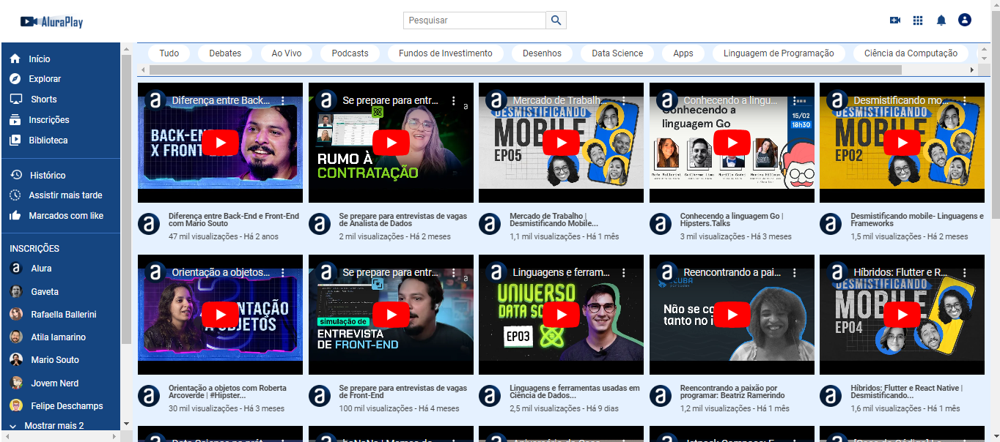

<h1>Alura Play</h1>

Projeto realizado durante o curso: Formação Front End T6 - ONE + Alura

O objetivo do projeto é criar um site responsivo semelhante ao Youtube, assim exercitando conhecimentos sobre CSS e FlexBox.

Realizei pequenas mudanças como troca de ícones e atualizar alguns vídeos que não estavam mais disponíveis. 

<h2>Preview 👀 </h2>

Deploy: https://joanatav.github.io/aluraplay-projeto-joana-tavares/

<h2>⚙️Tecnologias Utilizadas</h2>

